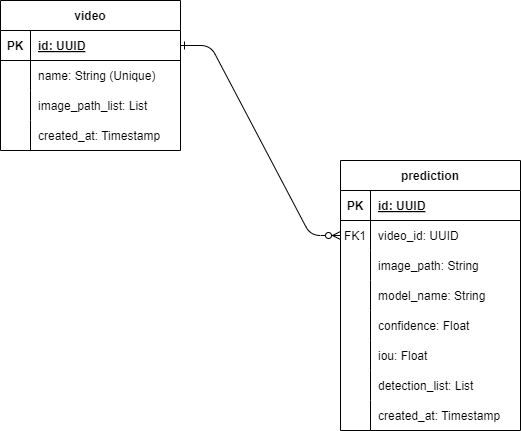

# Hi there! 👋

Be very welcome to my solution to my resolution to Overview Take-Home Assignment.

- [Introduction](#introduction)
- [Initial Considerations](#initial-considerations)
- [Backend Application](#backend-application)
- [Frontend Application](#frontend-application)
- [How to run the Project?](#how-to-run-the-project)


## Introduction

This project consists of the development of a backend application based on a REST API developed using Python and Flask framework and Postgres database for serving the AI model's predictions along with a frontend application developer using React.js and Fabric.js. All of them can be run using Docker containers.

## Initial Considerations

Unfortunately, I was unable to find the time to try to develop all the items required in the task. Still, I hope I met some expectations.

The following items were not implemented for evaluation:

- The frontend application does not play a video file and sends each frame to the API for prediction. Instead, the process occurs by uploading an image manually.

- There is no validation of values sent by the frontend application to the backend application. Therefore, values need to be sent as expected. For example, the Confidence value needs to be a number and not a string.

- There is no implementation of tests in both applications (backend and frontend). I recognize the importance of this in everyday work, but I didn't have time to do it.

Anyway, I believe this was a great challenge and I believe I managed to implement a good part of my knowledge working as a Software engineer.

## Backend Application

### Database

To use the project is needed to configure Postgres database. All the tables are defined in SQL scripts placed in **backend/db/sql** directory.

#### Tables

In what follows are the entity relationship diagram of the **Overview** database including the tables named **video** and **prediction**.

During the development of the solution, I created these tables with the aim of relating a video with a possible set of images sent for prediction.

In this way, the video table contains data from videos identified solely by their name. Each video contains a set of images that were sent for prediction.

The prediction table contains prediction data, where each one is associated with an image sent for prediction from a single video.



### API documentation

#### API endpoints

The API *endpoints* were documented using the [Flask-RESTX](https://flask-restx.readthedocs.io/en/latest/) framework that adds support for quickly building REST APIs.

After running the project, access the following URL through your web browser to view an HTML page that illustrates the information of the API endpoints:

```
http://{host}:5000/apidoc
```

**Note**:

- During the development of the solution, the API documentation and API endpoint were tested by replacing the **{host}** previously informed by **127.0.0.1**

#### Postman Collection

To support the use of the API, it was created the file **backend/app/docs/overview-full-stack-take-home-assignment.postman_collection.json** which contains a group of requests that can be imported into the **Postman** tool (an API client used to facilitate the creation, sharing, testing and documentation of APIs by developers.).

## Frontend Application

### Pages

#### Home

This page contains the purpose of the application.

#### Make Prediction

This page contains the mechanism for making a prediction.

It is possible to make a prediction using an image using prediction settings (model, confidence and iou).

To do it, perform the following steps:

**Step 1**

First, enter the name of the video to be recorded from which an image would be extracted for prediction.

As previously stated, a way to play a video and extract an image has not been implemented. So, I decided to create another way to do this. After that, click on the button below.

**Step 2**

Then, upload an image and see that it will appear below. For example, the test image sent in the challenge: `bus.png`. After that, click on the button below.

In this step the image will be sent to the backend application and the related video table record will be updated indicating that this image is associated with the previously registered video. In this case, the `image_path_list` field will contain the path of the image that was sent to the backend application.

**Step 3**

After that, select the model that will be used in the forecast and click on the button below to load it.

**Step 4**

Then, configure the additional Confidence and Iou parameter values to make the prediction.

**Step 5**

Then click on the button below to predict the image that was sent and then the table will be filled with the prediction data.

**Step 6**

Finally, to generate the related predicted image, click on the button below.

Examples:

[MakePredictionExample](backend/app/docs/MakePredictionExample.pdf)

#### Show Predictions

This page contains the mechanism for searching predictions.

It is possible to fetch the 10 most recent predictions related to a video.

To do it, perform the following steps:

**Step 1**

First, type the name of the video to be consulted to search for related predictions. After that, click on the button below.

**Step 2**

To get predictions related to the video, click on the button below.

Examples:

[ShowPredictionsResult](backend/app/docs/ShowPredictionsExample.pdf)

### About

This page contains my contact info.

## How to run the project?

The project can be run **locally** using a [**Docker**](https://www.docker.com/) container with commands from a Makefile file.

### Makefile file

A **Makefile** file was created as a single entry point containing a set of instructions to run all the project applications (backend and frontend) and the database using Docker containers via commands in the terminal.

To run the project with a Docker container, run the command:

```
make startup-apps
```

Note:

- If you don't have the dependencies needed to run instructions from a Makefile file, just copy and paste and run the Docker command related to the instruction above to run the project.

To finish the project, run the command:

```
make shutdown-apps
```